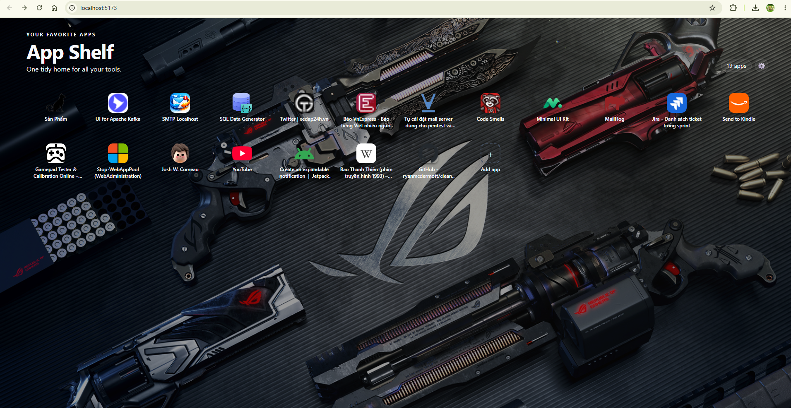
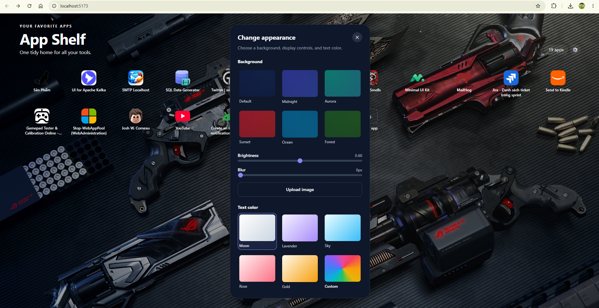

# App Shelf

App Shelf is a local-first web app launcher for collecting the browser-based tools you use every day. It presents bookmarks as a clean application grid, so a personal collection of local services, dashboards, and websites is easier to open and manage.

## Screenshots

### App grid



### Appearance controls



## Features

- Launch bookmarked web apps from a compact, customizable grid.
- Add a URL and automatically look up its page title and favicon through the metadata API.
- Keep bookmarks local to the browser with `localStorage` persistence.
- Enter Edit mode to reorder apps with drag and drop, edit their details, or remove them before saving the draft.
- Export all bookmarks to `.app-shelf` files or import them with URL-based upserts.
- Customize the background, brightness, blur, and text color; upload a local background image if desired.
- Switch between Vietnamese and English, and choose whether apps open in a new tab.

## Tech Stack

- **Frontend:** React, Vite, TypeScript, Tailwind CSS, and `@dnd-kit`.
- **Backend:** Express and Cheerio for safe URL metadata extraction.
- **Storage:** Browser `localStorage` for bookmarks and UI preferences.

## Getting Started

### Prerequisites

- Node.js 24 or later
- npm 11 or later

### Install and run

```bash
npm install
npm run dev
```

The development command starts both workspace apps:

- The Vite frontend, normally available at `http://localhost:5173`.
- The metadata API, normally available at `http://localhost:8787`.

## Available Commands

```bash
# Build the API and frontend for production
npm run build

# Run API and frontend tests
npm test

# Check code quality and formatting
npm run lint
npm run format:check

# Apply Prettier formatting
npm run format
```

## Docker

Run the production-style stack with Nginx serving the frontend and reverse-proxying API requests:

```bash
docker compose up --build
```

Open App Shelf at [http://localhost:20678](http://localhost:20678).

To stop the stack, run:

```bash
docker compose down
```

Only the web service is exposed on the host. The Express metadata API remains on the internal Compose network and is available through `/api` and `/health`.

When running with Docker, metadata lookups for bookmarks using `localhost` or a loopback address are routed internally through Docker's `host.docker.internal` gateway. The bookmark URL itself is not changed, so it still opens normally in the host browser.

## Project Structure

```text
apps/
  api/
    src/app.ts                 Express app composition
    src/routes/                HTTP route handlers
    src/services/              Metadata extraction service
  web/
    src/features/bookmarks/    Bookmark UI and feature types
    src/storage.ts             localStorage persistence
    src/styles.css             Tailwind component styles
docs/
  screenshots/ README demo images
```

## Metadata API

When a URL field loses focus in the add/edit dialog, the frontend calls the local metadata API. The API fetches the target page, extracts its title and favicon URL, resolves relative icon paths, and returns those values to the form. It accepts HTTP(S) URLs and protects the service from unsupported or unsafe targets while still allowing local tools hosted on `localhost` and loopback addresses.

## Code Quality

The repository uses ESLint with TypeScript, React Hooks, and React Refresh rules. Prettier is the single formatting source of truth; both tools are available through the root npm scripts above.

## License

Distributed under the [MIT License](LICENSE).
